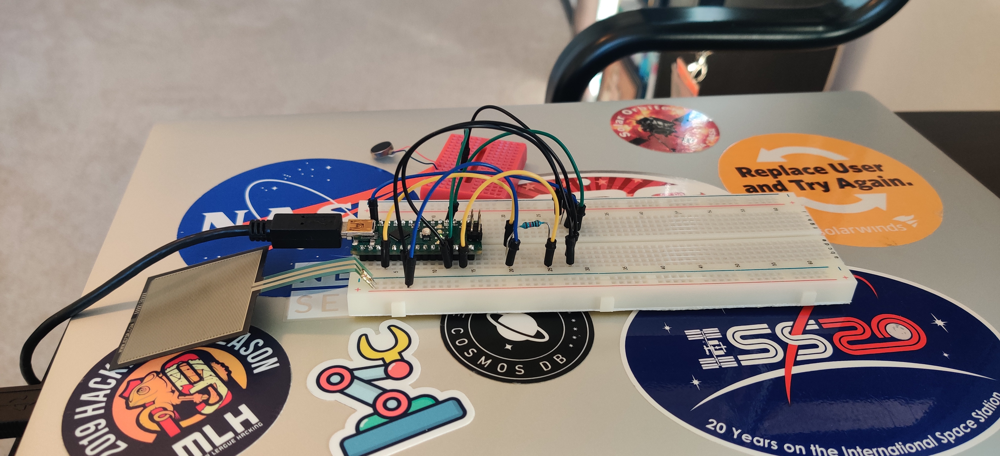

# fsr-arduino
An arduino module for classifying feedback data from a Force-sensing resistor and sending the appropriate feedback to a vibration motor.

## Setup
To run this module on your arduino you will need:
- Arduino Nano
- Force-sensing Resistor
- Vibration Motor

## Example Setup

